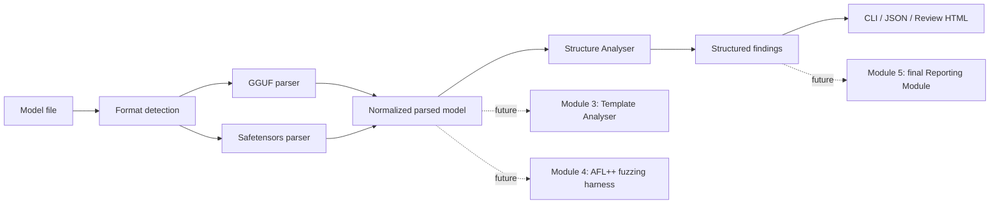

# First Review demonstration (3–5 minutes)

Run these commands from the repository root. The tiny model files are included in `samples/`; no model download is needed.

## One-time setup

```bash
python3 -m venv .venv
.venv/bin/python -m pip install -e ".[test]"
```

If Python's `venv` has no pip, use `uv venv --python 3.11 .venv` and `uv pip install --python .venv/bin/python -e '.[test]'`.

## What to say and show

### 0:00–0:45 — Architecture

“Module 1 reads the model container statically and turns GGUF or safetensors headers into one normalized result. Module 2 checks those facts for layout and size problems. It never runs a model.” Show this diagram:



### 0:45–1:45 — Valid safetensors

```bash
.venv/bin/python -m modelguard scan samples/valid_model.safetensors
```

Point out `Format: SAFETENSORS`, the two metadata fields, two tensor descriptors with dtype/shape/offsets, `Parser: OK`, and “No structural violations detected.”

### 1:45–2:30 — Valid GGUF

```bash
.venv/bin/python -m modelguard scan samples/valid_model.gguf
```

Point out GGUF version 3, `general.architecture`, `general.alignment`, the F32 tensor descriptor, and its checked data offset. This is a minimal structural container fixture, not an inference-ready model.

### 2:30–3:40 — Deliberately malformed GGUF and reports

```bash
.venv/bin/python -m modelguard scan samples/invalid_offset.gguf \
  --json review_artifacts/invalid_offset_gguf.json \
  --html review_artifacts/invalid_offset_gguf.html || true
open review_artifacts/invalid_offset_gguf.html
```

Point out **GG118**: the tensor range extends beyond the file. The command's exit code 1 is expected for an error finding; `|| true` lets the demonstration continue. In the HTML page, show the file summary, metadata, tensor table, and finding evidence. The JSON file contains the same normalized facts and finding IDs for tools to consume.

If you want to show a malformed safetensors example too:

```bash
.venv/bin/python -m modelguard scan samples/invalid_offsets.safetensors || true
```

### 3:40–4:30 — Tests and conclusion

```bash
.venv/bin/python -m pytest -q
```

Expected local result for this milestone: **50 passed**. Conclude: “The first review covers static parsing and structural anomaly detection only. Template analysis, fuzzing, and the final verdict/reporting module come later.”

## Prepared artifacts

- `valid_safetensors.json` and `valid_safetensors.html`: valid sample, extracted facts, no structural violations.
- `invalid_offset_gguf.json` and `invalid_offset_gguf.html`: malformed sample and the GG118 evidence.
- `valid_terminal.txt` and `invalid_terminal.txt`: captured CLI demonstrations.

All reports are generated from the committed synthetic fixtures. Regenerate the sample files with `.venv/bin/python samples/generate_samples.py` and the reports with the scan commands above.
